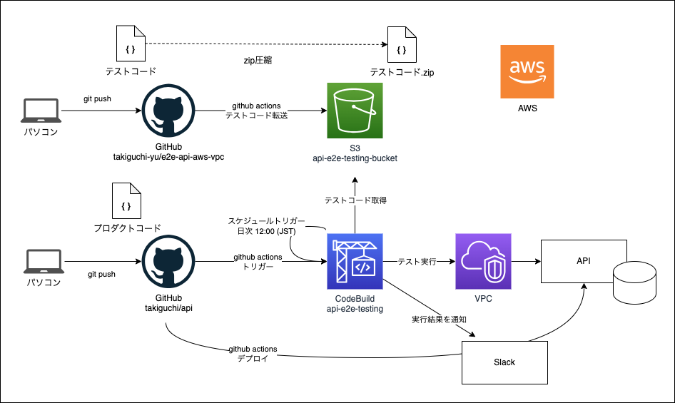

## 構成

API は WAF でアクセス制御しているため、VPC 内で実行する必要があります。github actions では直接実行できないため `CodeBuild` でテストコードを実行します。



## ローカル環境でテストコードを実行する方法

### API キーの設定

```sh
cp .env.example .env
```

### CLI で実行する場合

```sh
npx playwright test
# ファイル指定で実行する方法
npx playwright test tests/petstore.spec.ts
```

### Docker Image で実行する場合

```sh
# ビルド
# NetSkope を disable
docker build -t api-e2e-testing .
# テスト実行
# NetSkope を enable
docker run --rm api-e2e-testing
```

## AWS 構築手順

## 手動で CodeBuild を実行する方法

1. AWS アカウントにログインして `CodeBuild` を開きます。
2. CodeBuild を開いたら api-e2e-testing という名前のプロジェクトがあるため、クリックします。
3. 右上に「 `ビルドを開始` 」というオレンジのボタンがあるため、クリックします。
4. ビルドが開始されます。
